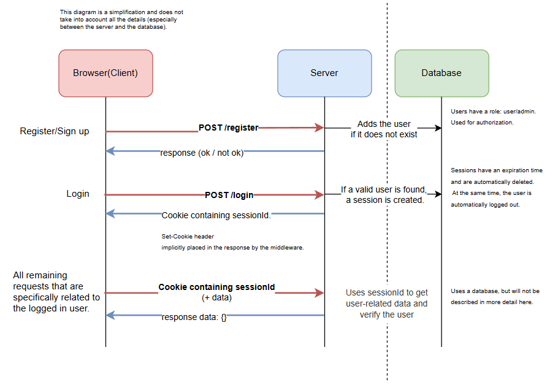
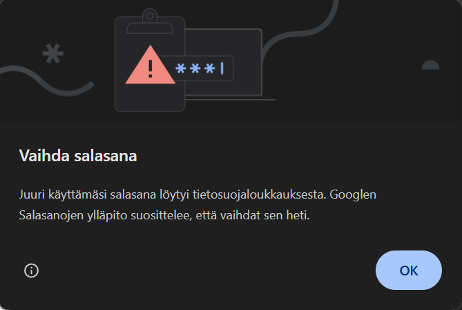

# Signup/Login System

A fullstack web application for user registration, login, and role-based access control built with React, Redux, Express, MongoDB, and TailwindCSS — containerized using Docker.

---

## 🚀 How to Run the Program

##### Prerequisites

- _Docker_ installed ([Download Docker](https://www.docker.com/get-started))
- _Docker Compose_ (comes bundled with Docker Desktop)

##### Clone the repository and run the application

```bash
git clone <repository-url>
cd signup-login-system
docker compose up -d
```

- Once the containers are running, open your browser and navigate to http://localhost:4000

---

## 📚 About

This project demonstrates a fullstack implementation of a secure user authentication system. It allows users to register and log in, handles persistent sessions with cookies, and implements role-based authorization. The system includes both frontend and backend services, each containerized with its own Dockerfile, and coordinated via Docker Compose. One default admin account is created on startup _(name: admin, password: admin)_.

During the project I learned:

- How to build a full-stack app
- API design and structure
- Cookies and session handling
- Security (XSS protection, backend input validation)
- Containerization with Docker
- Redux state management
- Basic admin functionality, authorization, and authentication
- Perform static code analysis with SonarQube

---

## 📘 Longer (and more detailed) explanation

The project structure is split into a frontend and a backend, each containing its own Dockerfile. These are brought together using a docker-compose.yaml file, which orchestrates the build and deployment of all services.

The quality and security of the code were tested using SonarQube. This tool provides static code analysis, which focuses on my code itself rather than runtime behavior. It does not simulate API requests or test the behavior of HTML components. Instead, it checks the structure, syntax, and patterns of the code to highlight potential bugs or vulnerabilities in the logic.

React automatically helps to mitigate XSS attacks by sanitizing everything that is rendered onto the screen. However, it does not sanitize what users type or submit. Because of this, I implemented input validation on the backend using the Joi library. Joi ensures that the request bodies match the expected format and structure before they are processed. In addition to this validation, I use the express-xss-sanitizer middleware to sanitize all incoming request data. This adds another layer of protection against cross-site scripting by cleaning inputs before they are handled.

The application uses cookie-based sessions to manage user authentication. When a user logs in, the server assigns a session ID and sends it back to the browser as a cookie. This session ID is also stored in MongoDB alongside with other session data, allowing the server to identify the user in future requests. If the session cookie expires or the user logs out, the session is deleted from the database, and the session cookie can no longer be used. This approach supports automatic logout and ensures secure session handling.

Usernames in the system must be unique. When a new user registers, their information is saved to the database. After a successful login, the user is directed to their personalized environment, and their browser receives a cookie that contains the session ID. The server uses this session to authenticate requests and fetch user-specific data.

The application supports role-based access control. There are two roles: user and admin. An admin user is automatically created when the application starts, with the credentials admin for both the username and password. Admin users can delete regular users. The application's state persists even when the page is refreshed. If a logged-in user closes the browser and later returns, they remain logged in as long as the session is still valid.

<br><br>

<div style="text-align: center;">
  
  <br/>
  <em>Figure 1: Login and registration flow of the app</em>
</div>

<br><br>

The .env files are deliberately included in the public repository to simplify testing/exploring my project. In a production environment, this should be avoided, as those files can contain sensitive information. However, in this project, they do not contain any real secrets. Throughout my code, there might be comments marked with **// TODO:** to indicate areas where improvements could be made. For example, password hashing is currently not implemented, as the project's primary focus was on building a functioning login and registration flow, along with secure session handling and user management.

<br><br>

<div style="text-align: center;">
  
  <br/>
  <em>Figure 2: This message appears because the Express server runs over http and not https. HTTP is inherently not secure, so the message is valid. For production purposes, it is a good idea to switch to https.</em>
  <br>
</div>

<br><br>

Feel free to explore the app, test its features, and experiment with different use cases. Whether to test the frontend or backend security features, there's a lot to discover.